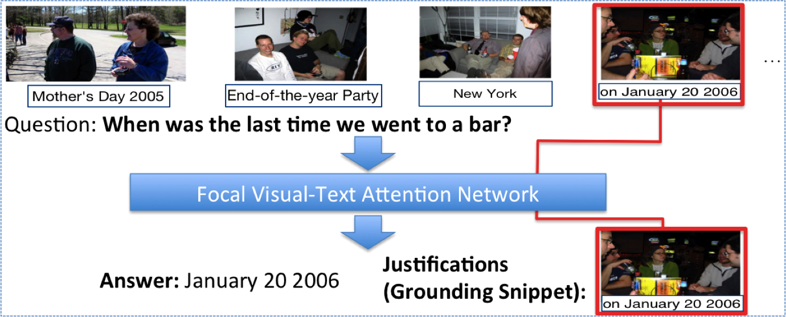
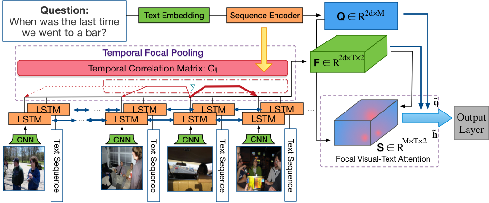

# Focal Visual-Text Attention for Visual Question Answering

**Check out our MemexQA dataset [here](https://memexqa.cs.cmu.edu/). It is published on IEEE Transactions on Pattern Analysis and Machine Intelligence (TPAMI).**

This repository contains the code and models for our CVPR 2018 spotlight paper:

    Junwei Liang, Lu Jiang, Liangliang Cao, Li-Jia Li, Alexander Hauptmann
    "Focal Visual-Text Attention for Visual Question Answering"
    in Proc. CVPR 2018

<div align="center">
  
  <p>Example FVTA Output. </p>
</div>

If you find the code useful for your research, please cite our paper:

        @inproceedings{liang2018focal,
          title={Focal Visual-Text Attention for Visual Question Answering},
          author={Liang, Junwei and Jiang, Lu and Cao, Liangliang and Li, Li-Jia and Hauptmann, Alexander},
          booktitle={Conference on Computer Vision and Pattern Recognition (CVPR)},
          year={2018}
        }

## Dependencies
+ Python 2.7; TensorFlow >= 1.4.0; tqdm and nltk (for preprocessing)
+ Preprocessed [MemexQA data](https://memexqa.cs.cmu.edu/fvta_model_zoo/prepro_v1.1.tgz), which you can process yourself with the [MemexQA dataset v1.1](https://memexqa.cs.cmu.edu/memexqa_dataset_v1.1/). 
+ Pre-trained [models](https://memexqa.cs.cmu.edu/fvta_model_zoo/) from the fvta model zoo. Each extracted model file looks like this:
```
├── fvta
│   └── 00
│       ├── best
│       │   ├── checkpoint
│       │   ├── save-best-751000.data-00000-of-00001
│       │   ├── save-best-751000.index
│       │   └── save-best-751000.meta
│       ├── shared.p
│       └── test_best
│           └── answers.json
```

## Model

<div align="center">
  
  <p>Focal Visual-Text Attention Network. </p>
</div>


## Code Structure

The main entrance for the code base is `main.py`. It has two modes: training and testing. It will first load the desired model class from `model.py/model_v2.py/model_mcb.py/model_dmnplus.py` to contruct the model graph and will attempt to load weights if provided `--load/--load_best`.

## Testing
The testing code assumes the following directory structure. Download the corresponding model file from the [model zoo](https://memexqa.cs.cmu.edu/fvta_model_zoo/) and extract in the `models` directory. Extract the [preprocessed data](https://memexqa.cs.cmu.edu/fvta_model_zoo/prepro_v1.1.tgz) into the current directory. 
```
DIR/
  *.py
  models/
    model_name/
      00/
        ..
  prepro_v1.1/
    ..
```

Results as in the paper:


|<sub> Method </sub>  |<sub>  Test Accuracy </sub> |
|:------------------|:-------------------|
| <sub>**DMN+**</sub> | 0.4795 |
| <sub>**MCB+**</sub> | 0.4623 |
| <sub>**Soft Attention**</sub> | 0.6208 |
| <sub>**Soft Attention Bi-directional (BiDAF)**</sub> | 0.5979 |
| <sub>**TGIF Attention**</sub> | 0.6296 |
| <sub>**FVTA**</sub> | 0.6686 |


|<sub> Abalations </sub>  |<sub>  Test Accuracy </sub> |
|:------------------|:-------------------|
| <sub>**FVTA_no_question attention**</sub> | 0.6287 | 
| <sub>**FVTA_no_photo**</sub> | 0.5773 |
| <sub>**FVTA_no_timewarp**</sub> | 0.6132 |
| <sub>**FVTA_no_intraseq**</sub> | 0.5691 |
| <sub>**FVTA_no_crossseq**</sub> | 0.6041 |
| <sub>**FVTA_cosine**</sub> | 0.6192 |

1. DMN+ 

Test accuracy: 0.479513987002
```
$ python main.py prepro_v1.1/ models/ --modelname dmnplus --batch_size 64 --hidden_size 512 \
--dmnplus --image_feat_dim 2537 --is_test --load_best
```


2. MCB

Test accuracy: 0.462277479514
```
$ python main.py prepro_v1.1/ models/ --modelname mcb --batch_size 64 --hidden_size 200 \
--image_feat_dim 2537 --use_char --char_emb_size 100 --char_out_size 100 --add_tanh --mcb \
--mcb_outdim 1024  --is_test  --load_best
```


3. Soft Attention 

Test accuracy: 0.620796835264
```
$ python main.py prepro_v1.1/ models --modelname soft_att --batch_size 64 --hidden_size 50 \
--image_feat_dim 2537 --use_image_trans --image_trans_dim 100 --use_direct_links --direct_links_only \
--use_char --char_emb_size 100 --char_out_size 100 --is_test --use_question_att --simiMatrix 2 \
--load_best
```

4. Soft Attention Bi-directional (BiDAF)

Test accuracy: 0.597909013846
```
$ python main.py prepro_v1.1/ models --modelname soft_att_bidirect --batch_size 64 \
--hidden_size 50 --image_feat_dim 2537 --use_image_trans --image_trans_dim 100 --use_direct_links --direct_links_only \
--use_char --char_emb_size 100 --char_out_size 100 --is_test --load_best --use_question_att \
--simiMatrix 2 --use_bidirect
```


5. TGIF Attention

Test accuracy: 0.629556371856
```
$ python main.py prepro_v1.1/ models/ --modelname tgif  --batch_size 64 --hidden_size 50 \
--image_feat_dim 2537 --use_image_trans --image_trans_dim 100 --use_char --char_emb_size 100 \
--char_out_size 100 \
--add_tanh --simiMatrix 2 --use_tgif_ml_att --is_test --load_best
```


6. FVTA

Test accuracy: 0.668550437977
```
$ python main.py prepro_v1.1 models/ --modelname fvta --hidden_size 50 --image_feat_dim 2537 \
--use_image_trans --image_trans_dim 100 --use_char --char_emb_size 100 --char_out_size 100 --add_tanh \
--simiMatrix 2 --use_question_att --use_3d --use_time_warp --warp_type 5 --is_test --load_best \
--batch_size 1
```


7. Abalation Experiments

- FVTA_no_question attention. Test accuracy: 0.628708674767
```
$ python main.py prepro_v1.1 models/ --modelname fvta_no_qatt --hidden_size 50 --image_feat_dim 2537 \
--use_image_trans --image_trans_dim 100 --use_char --char_emb_size 100 --char_out_size 100 --add_tanh \
--simiMatrix 2 --use_3d --use_time_warp --warp_type 5 --is_test --load_best --batch_size 1
```

- FVTA_no_photo. Test accuracy: 0.577281717999
```
$ python main.py prepro_v1.1 models/ --modelname fvta_no_photo --hidden_size 50 --image_feat_dim 2537 \
--use_image_trans --image_trans_dim 100 --use_char --char_emb_size 100 --char_out_size 100 --add_tanh \
--simiMatrix 2 --use_question_att --use_3d --use_time_warp --warp_type 5 --is_test --load_best \
--batch_size 1 --no_photo
```

- FVTA_no_timewarp. Test accuracy: 0.613167561458
```
$ python main.py prepro_v1.1 models/ --modelname fvta_notimewarp --hidden_size 50 --image_feat_dim 2537 \
--use_image_trans --image_trans_dim 100 --use_char --char_emb_size 100 --char_out_size 100 --add_tanh \
--simiMatrix 2 --use_question_att --use_3d --is_test --load_best --batch_size 32
```


- FVTA_no_intraseq. Test accuracy: 0.5690873128
```
$ python main.py prepro_v1.1/ models/ --modelname fvta_no_intraseq --batch_size 64 --hidden_size 50 \
--image_feat_dim 2537 --use_image_trans --image_trans_dim 100 --use_char --char_emb_size 100 \
--char_out_size 100 --use_mm_att --simiMatrix 2 --use_question_att --is_test --load_best
```

- FVTA_no_crossseq. Test accuracy: 0.604125459169
```
$ python main.py prepro_v1.1/ models/ --modelname fvta_no_crossseq --batch_size 64 --hidden_size 50 \
--image_feat_dim 2537 --use_image_trans --image_trans_dim 100 --use_char --char_emb_size 100 --char_out_size \
100 --use_ml_att --simiMatrix 2 --use_question_att --is_test --load_best
```

- FVTA cosine. Test accuracy: 0.619666572478
```
$ python main.py prepro_v1.1 models/ --modelname fvta_cosine --hidden_size 50 --image_feat_dim 2537 \
--use_image_trans --image_trans_dim 100 --use_char --char_emb_size 100 --char_out_size 100 --add_tanh \
--simiMatrix 4 --use_question_att --use_3d --use_time_warp --warp_type 5 --is_test --load_best \
--batch_size 1
```

## Evaluation

After running the testing code, it will output the accuracy on test set, and save the answers in `model_name/00/test_best/answers.json`. You can use the following code to get more detailed evaluation. Need the [MemexQA v1.1 dataset](https://memexqa.cs.cmu.edu/memexqa_dataset_v1.1/)

```
$ python evaluate-v0.1.py memexqa_dataset_v1.1/qas.json memexqa_dataset_v1.1/test_question.ids \
models/fvta/00/test_best/answers.json --bucket memexqa_dataset_v1.1/qatype.bucket.json
got 3539 ground truth qa
Overall acc: 0.668550437977 (2366/3539)
        group how: 0.761336515513 (319/419)
        group what: 0.713611859838 (1059/1484)
        group when: 0.476439790576 (273/573)
        group where: 0.675986842105 (411/608)
        group who: 0.668131868132 (304/455)
how what when where who overall
0.761336515513 0.713611859838 0.476439790576 0.675986842105 0.668131868132 0.668550437977

```

## Training

Train the FVTA model:
```
$ python main.py prepro_v1.1 models/ --modelname fvta_newtrain --hidden_size 50 --image_feat_dim 2537 \
--use_image_trans --image_trans_dim 100 --use_char --char_emb_size 100 --char_out_size 100 --add_tanh \
--simiMatrix 2 --use_question_att --use_3d --num_albums_thres 4 --num_photos_thres 8 --sent_des_size_thres \
10 --sent_album_title_size_thres 8 --sent_photo_title_size_thres 8 --use_time_warp --warp_type 5 \
--is_train --batch_size 6 --val_num_batches 2000 --save_period 1000 --num_epochs 200 --init_lr 0.5
```

This will take about 50 hours with a TITAN X GPU using about 9GB GPU memory. All other models are also train with the following hyperparameters, with different batch_size depending on whether it could fit in the GPU:
```
--batch_size 6 --val_num_batches 2000 --save_period 1000 --num_epochs 200 --init_lr 0.5 --num_albums_thres 4 \
--num_photos_thres 8 --sent_des_size_thres 10 --sent_album_title_size_thres 8 \
--sent_photo_title_size_thres 8
```

## Preprocess data

1. Download MemexQA dataset v1.1 from [here](https://memexqa.cs.cmu.edu/memexqa_dataset_v1.1/)

2. Run the code at the same directory
```
$ python preprocess.py memexqa_dataset_v1.1/qas.json memexqa_dataset_v1.1/album_info.json \
memexqa_dataset_v1.1/test_question.ids memexqa_dataset_v1.1/photos_inception_resnet_v2_l2norm.npz \
memexqa_dataset_v1.1/glove.6B.100d.txt prepro_v1.1
```
